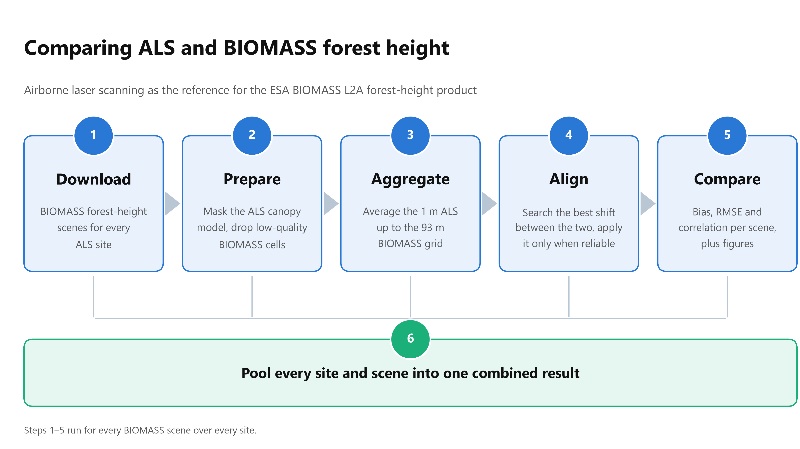
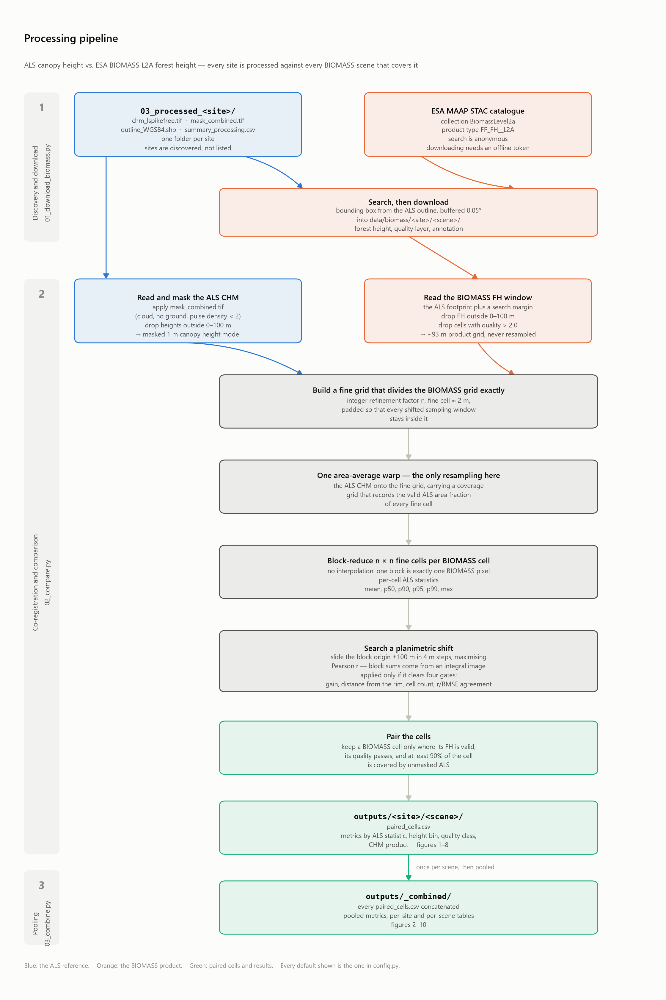

# ALS canopy height vs. spaceborne forest height products

Airborne laser scanning (ALS) from three central African forest sites, used as
the reference for two spaceborne canopy height products: the **ESA BIOMASS
Level-2a forest height** product and the **ETH global 10 m canopy height** map
(Lang et al. 2023). The pipeline downloads both products, co-registers them with
the ALS, reports the standard validation statistics per scene and per site, and
pools everything into a combined analysis.



## Quick start

```bash
conda create -n biomass_gt python=3.11
conda activate biomass_gt
pip install -r requirements.txt

python 01_download_biomass.py --list-only          # search, no token needed
python 01_download_biomass.py --token <offline-token>
python 01b_download_eth.py                         # ETH 10 m product, no token
python 02_compare.py                               # per-scene results
python 02b_compare_eth.py                          # ETH vs ALS on the ETH grid
python 03_combine.py                               # pooled, all-scene results
```

Per-scene results land in `outputs/<site>/<scene>/`, pooled results in
`outputs/_combined/`, and the ETH-on-its-own-grid comparison in
`outputs_eth/<site>/`.

Sites are **discovered, not configured**: every `03_processed_<site>` folder in
the repository is picked up automatically, so adding a fourth site means
dropping in its folder and re-running. `--site <name>` restricts any step.

## Data

The repository holds code and results. **None of the three input datasets is
included**, for different reasons.

**ALS products — not redistributable.** Access is closed (see References), so
`03_processed_*/` is gitignored. To reproduce, place one folder per site at the
repository root named `03_processed_<site>`; sites are discovered from that
pattern, so the name is the only registration step. Each folder needs:

| File | Used for | Required |
|---|---|---|
| `chm_lspikefree.tif` | the canopy height reference | yes |
| `mask_combined.tif` | quality masking | yes |
| `outline_WGS84.shp` (+ `.dbf`, `.shx`, `.prj`) | building the BIOMASS catalogue search box | yes |
| `summary_processing.csv` | site name and acquisition dates, stamped on every figure | yes |
| `chm_tin.tif` | the `--chm-secondary` sensitivity check | drop it with `--chm-secondary none` |
| `mask_pd04.tif`, `mask_steep.tif` | `--strict-mask` only | no |

**BIOMASS products — freely available but bulky**, so `data/` is gitignored.
Step 1 downloads them; re-running it is the intended way to obtain them.

**ETH canopy height — freely available and small**, because step 1b clips it to
the footprints rather than fetching whole tiles. Also under `data/`, so also
gitignored, and also re-obtained by re-running the step.

`outputs/` **is** tracked — the figures and metric tables are the deliverable of
this repository. So is `outputs_eth/`, except for its per-cell
`paired_cells_eth.csv` tables, which run to tens of megabytes because a 10 m
grid has a hundred times the cells of a 93 m one.

## The sites

| | Loundoungou | Luki2025 | Mbalmayo |
|---|---|---|---|
| Country | Rep. of the Congo | DR Congo | Cameroon |
| Centre | 17.06 °E, 2.37 °N | 13.10 °E, 5.62 °S | 11.45 °E, 3.43 °N |
| CRS | EPSG:32633 | EPSG:32733 | EPSG:32632 |
| Extent | 17.5 km² | 4.1 km² | 17.1 km² |
| ALS acquisition | 19–24 Mar 2025 | 18–22 Oct 2025 | 8–13 Feb 2024 |
| Pulse density | 351 m⁻² | 923 m⁻² | 389 m⁻² |
| Mean CHM | 30.1 m | 23.7 m | 19.6 m |
| 99th pct CHM | 46.6 m | 52.7 m | 42.5 m |

All three were processed with the Global Canopy Atlas ALS pipeline v1.1.0
(Fischer et al. 2024), so the products and masks mean the same thing at every
site.

## The ALS reference: which product, and why

`chm_lspikefree.tif` — the locally adaptive spike-free canopy height model —
with `mask_combined.tif` applied.

The GCA pipeline ships four CHM variants, and its own documentation
(`03_processed_<site>/_INFO_products.csv`) makes the choice for us:

| Product | Verdict |
|---|---|
| **`chm_lspikefree.tif`** | **Used.** Documented as "recommended for comparative analyses across time and space"; spike-free interpolation that adapts to local pulse density, so the height estimate does not drift with scan geometry. Exactly the property a cross-sensor, cross-site comparison needs. |
| `chm_highest.tif` | Rejected. Explicitly "not recommended for comparative analyses across time or space with varying scanning properties" — highest-return heights are density dependent, and pulse density varies 351–923 m⁻² across these sites. |
| `chm_tin.tif` | Not primary. Triangulation of first returns, full of pits and spikes; interpretable as mean interception height rather than top-of-canopy height. Retained as a cross-check (`--chm-secondary`, on by default) so the sensitivity of the results to this choice stays visible. |
| `chm_spikefree.tif` | Rejected. Present on disk but not in the product manifest; the non-adaptive predecessor of `chm_lspikefree`. |

`mask_combined.tif` bundles the cloud, no-ground and pulse-density-below-2
masks, which the documentation says "should always be applied". The stricter
`mask_pd04` and `mask_steep` layers are available via `--strict-mask`.

On the BIOMASS side the comparison uses the `FP_FH__L2A` product type
(collection `BiomassLevel2a`), which is the forest height product proper;
`FP_GN__L2A` (ground notch) and `FP_FD__L2A` (forest disturbance) are different
quantities.

## The BIOMASS scenes

Seven `FP_FH__L2A` scenes cover the three footprints; six yield a usable
comparison.

| Site | Scene sensing window | Gap after ALS | Paired cells |
|---|---|---|---|
| Loundoungou | 19–31 May 2026 | ~14 months | 1945 |
| Loundoungou | 9–21 Jun 2026 | ~15 months | 1056 |
| Luki2025 | 12–24 Dec 2025 | ~2 months | *no valid data over the footprint* |
| Luki2025 | 15–27 Dec 2025 | ~2 months | 313 |
| Luki2025 | 14–26 Jan 2026 | ~3 months | 342 |
| Mbalmayo | 24 Nov – 6 Dec 2025 | ~21 months | 789 |
| Mbalmayo | 15–27 Dec 2025 | ~22 months | 482 |

The skipped Luki scene overlaps the footprint by bounding box, but its usable
swath lies elsewhere — every FH pixel over the site is no-data. The script
detects this and moves on.

## The ETH global canopy height map

[Lang et al. (2023)](https://doi.org/10.1038/s41559-023-02206-6) published a
global 10 m canopy top height map regressed from Sentinel-2 with GEDI as the
training reference, representative of **2020**. It is included here as a second
spaceborne product, so that BIOMASS is judged against something other than the
ALS alone.

`01b_download_eth.py` fetches it. The published tiles are 3° × 3° cloud-optimised
GeoTIFFs of roughly 400 MB each, but because they are COGs the script reads only
the window covering each ALS outline straight over HTTP — under 1 MB per site
instead of 1.3 GB. No account and no token: the data is CC BY 4.0.

```bash
python 01b_download_eth.py --list-only   # report the tiles each site needs
python 01b_download_eth.py               # clip them into data/eth/<site>/
```

## Method: resampling and co-registration

The ALS reference and the BIOMASS product differ by a factor of ~93 in cell size
and sit in different coordinate systems, so they have to be brought onto one grid
before anything can be compared. Every choice below follows from one decision.
The same machinery is reused for the ETH product, which needs no separate method
section: only the target grid changes.



Every threshold shown on it is the default from `config.py`.

### The governing decision: aggregate up, never down

**The BIOMASS grid is the target grid and is never resampled.** Interpolating a
~93 m product onto a 1 m grid would invent detail it does not have, and would
make neighbouring residuals correlated — which inflates every agreement
statistic while looking like a better result. So the ALS is aggregated *up* to
the BIOMASS cells, and BIOMASS pixel values are used exactly as delivered.

### Step 0 — Preparing the ALS reference

`chm_lspikefree.tif` is read at its native 1 m resolution in the site's UTM CRS.
Then, in order:

* `mask_combined.tif` is applied. In the GCA pipeline a mask marks *invalid*
  pixels by setting them to no-data, so a pixel survives only where the mask
  raster is finite. `--strict-mask` additionally applies `mask_pd04` and
  `mask_steep`.
* Heights outside 0–100 m are dropped as physically implausible. (The pipeline's
  own ceiling is 125 m; Luki's raw CHM reaches it, which is noise rather than
  canopy.)

Everything removed becomes `nan`, and `nan` propagates as "no contribution"
through every later step rather than as a zero.

### Step 1 — A fine grid that divides the BIOMASS grid exactly

A working grid is constructed as an **exact integer refinement** of the BIOMASS
window:

```
refine = ceil(min(cell_x, cell_y) / FINE_CELL_M)        # 93 m / 1 m -> 93
fine_transform = fh_transform * translate(-pad, -pad) * scale(1 / refine)
```

with `pad = ceil(SHIFT_SEARCH_M / cell) + 1` BIOMASS cells of margin on each
side, so that a shifted sampling window can never run off the grid. Because
`refine` is an integer, every BIOMASS cell corresponds to exactly `refine ×
refine` fine cells — 93 × 93 = 8649 at these sites — with no cell straddling a
boundary.

Cell sizes are computed in metres even though the BIOMASS products are in
geographic coordinates (EPSG:4326), converting with
`cos(latitude)` on the x axis so the refinement is isotropic on the ground.

### Step 2 — One area-average warp (the only resampling in the pipeline)

The masked ALS CHM is warped from its UTM grid onto the fine grid with GDAL's
**area-weighted average** (`Resampling.average`), so each fine cell receives the
mean of the 1 m pixels overlapping it, weighted by overlap area. `src_nodata` is
`nan`, so masked pixels contribute nothing rather than dragging the average
toward zero.

A **second warp** carries a validity layer — 1.0 where the ALS pixel is valid,
0.0 where it is not — through the same area-average. Its result is the
**coverage fraction** of each fine cell: the share of the cell's area backed by
real, unmasked ALS. Fine cells with no contribution at all are set to `nan` with
coverage 0.

This is the only interpolation anywhere in the comparison. Everything above it
is exact arithmetic.

**The fine cell is 1 m, matching the native ALS resolution.** The intermediate
grid neither coarsens nor upsamples the ALS: each fine cell takes essentially
one source pixel, so the per-cell percentiles in step 3 are computed over the
canopy surface as measured rather than over pre-averaged blocks.

This was not always the default. A 2 m fine cell was used first, and it biases
the ALS reference low — measured at Loundoungou, moving from 2 m to 1 m raises
ALS p90 by **+0.14 m**, moves bias by −0.14 m and RMSE by +0.04 m, because
averaging to 2 m clips the extremes a high percentile is meant to capture. Small
against an RMSE of ~4 m, but a real smoothing, and there is no reason to accept
it when the native data is 1 m.

The cost is memory: the fine grid scales with the inverse square of the cell
size, so 1 m needs about four times what 2 m did — a peak of ~2.5 GB on the
largest site here. Raise `--fine-cell` if a run does not fit.

### Step 3 — Block reduction into BIOMASS cells (no interpolation)

Each BIOMASS cell is summarised from its own `refine × refine` block of fine
cells:

| Quantity | How |
|---|---|
| `mean` | coverage-weighted, `Σ(vᵢwᵢ) / Σwᵢ`, so partly covered fine cells count in proportion to the area they actually carry |
| `p50`, `p90`, `p95`, `p99` | `nanpercentile` over the block's fine values, unweighted — the fine cells are equal-area by construction, so this is a percentile of an area-regular sample of the canopy surface |
| `max` | maximum of the block's finite fine values |
| `coverage` | `Σwᵢ / refine²` — the fraction of the BIOMASS cell backed by valid ALS |
| `n_fine` | count of finite fine cells in the block |

No interpolation and no partial cells are involved: this is a straight
reduction of a fixed set of values per cell.

### Step 4 — The shift search

BIOMASS geolocation is not guaranteed to be perfect, so a planimetric offset is
searched for. The block origin is slid across the fine grid and the whole
aggregation is recomputed at each candidate offset.

* **Offsets tested.** Every `--shift-step` metres (default 4 m) over
  ±`--shift-search` metres (default 100 m), in both axes — a 53 × 53 grid of
  2809 candidates, evaluated exhaustively rather than by local optimisation.
* **Why that is affordable.** Block sums come from **summed-area tables**
  (integral images) of `v·w` and of `w`. Once built, the sum over any block is
  four array lookups, so the mean at every cell for any offset costs O(cells)
  rather than O(cells × refine²).
* **Objective.** Pearson correlation between the aggregated ALS mean and the
  BIOMASS heights (`--shift-criterion rmse` switches to minimising RMSE).
  Correlation is the standard choice because it is unaffected by an overall
  height offset between the two sensors, which is exactly the quantity being
  measured elsewhere.
* **The comparison set is held fixed across all offsets** — cells with a valid
  BIOMASS height and full ALS coverage at zero offset, then binary-eroded by the
  search radius. Without this, an offset could score well simply by pulling the
  sampling window into a better-covered part of the scan.
* **Sign convention.** The reported offset is that of the *ALS sampling window*.
  An offset of (−40 m, +20 m) means the ALS window that best matches a BIOMASS
  cell lies 40 m west and 20 m north of its nominal position — equivalently,
  BIOMASS is geolocated 40 m east and 20 m south relative to the ALS.

#### When a shift is actually applied

A search always returns *some* optimum. Four checks decide whether it describes
a real geolocation offset or merely the best of thousands of chance fits;
failing any one means the optimum is reported but **not** applied:

| Check | Rejects |
|---|---|
| ≥ `--shift-min-cells` cells (default 150) in the search set | a search over thousands of offsets fitted to a handful of cells |
| optimum within 60 % of the search radius | an objective that runs to the rim instead of peaking inside it — the signature of a large-scale trend, not an offset |
| r-optimum and RMSE-optimum agree within 40 m | the two criteria pointing to different parts of the window, i.e. no consistent alignment |
| correlation gain ≥ 0.05 | a shift that buys nothing |

`--force-shift` applies the optimum regardless; `--no-shift-search` skips the
search entirely. Either way the offset found and the verdict are recorded in
`outputs/summary_all_products.csv`.

### Step 5 — Pairing

A BIOMASS cell enters the statistics only if all three hold:

1. BIOMASS reports a valid forest height there (not no-data, within 0–100 m);
2. its quality value passes the filter (`--quality-max`, default 2.0);
3. at least `--min-coverage` (default 90 %) of the cell's area carries valid,
   unmasked ALS.

Condition 3 is what keeps footprint edges out of the comparison: a cell half
outside the scan would otherwise contribute an ALS statistic computed from
whatever fraction happened to be inside it.

### Validation of the whole chain

The pipeline was tested end to end against a synthetic BIOMASS-like product
built from the ALS data with a **known** 40 m east / 20 m south geolocation
error, a known bias and scale, and known noise. It recovered the shift to within
1.5 m (one fine cell) and the injected slope, intercept and residual spread to
two decimals. That harness is not part of this repository, so the check is not
reproducible from a fresh clone.

## Results

**No shift was applied to any of the six scenes** — every one failed the checks
above, so all results are at the nominal geolocation. The reason per scene is in
the `shift_verdict` column of `outputs/summary_all_products.csv`.

### Pooled over all sites and scenes

ALS p90 per cell, quality-filtered, n = 4927 cells:

| | |
|---|---|
| ALS reference | 36.94 ± 6.24 m |
| BIOMASS FH | 32.58 ± 7.19 m |
| **bias** | **−4.36 m** (−11.8 %) |
| MAE | 5.57 m |
| **RMSE** | **7.58 m** (20.5 %) |
| centred RMSE | 6.20 m |
| Pearson r | 0.583 |
| Spearman ρ | 0.547 |
| CCC | 0.477 |
| OLS / RMA slope | 0.67 / 1.15 |
| 95 % limits of agreement | [−16.51, +7.78] m |

### Per site

| Site | scenes | n | ALS | BIOMASS | bias | RMSE | r |
|---|---|---|---|---|---|---|---|
| Loundoungou | 2 | 3001 | 39.26 ± 3.18 m | 37.03 ± 2.69 m | −2.23 m | 4.25 m (10.8 %) | 0.25 |
| Luki2025 | 2 | 655 | 38.63 ± 8.53 m | 29.17 ± 7.31 m | −9.46 m | 13.51 m (35.0 %) | 0.26 |
| Mbalmayo | 2 | 1271 | 30.59 ± 5.93 m | 23.81 ± 5.14 m | −6.78 m | 9.26 m (30.3 %) | 0.36 |

Three things are worth reading carefully:

**Pooling raises the correlation far above any single site** — r = 0.58 pooled
against 0.25–0.36 within sites. This is the height-range effect, not better
performance: pooled ALS p90 has an SD of 6.2 m against ~3 m at Loundoungou.
Within one uniform site there is barely any height signal for BIOMASS to track.
The pooled r is the fairer measure of how the product behaves across a real
landscape gradient; the within-site r is close to meaningless.

**BIOMASS underestimates at every site and in every scene**, from −1.3 m to
−13.5 m, and the pooled RMA slope of 1.15 against an OLS slope of 0.67 indicates
the product compresses the height range. The residual-vs-height figure shows the
same thing directly and consistently across all three sites: BIOMASS reads high
over short canopy and increasingly low over tall canopy.

**Scene-to-scene spread within a site is large** — Luki's two usable scenes
differ by 7.8 m in bias (−13.5 vs −5.8 m) despite being one month apart over
identical forest. Whatever drives that is a property of the retrieval, not of
the canopy.

The three sites also differ in ALS-to-BIOMASS time gap (2, 14 and 21 months),
which is confounded with site throughout — see the caveats.

### Which ALS statistic?

BIOMASS FH estimates *top canopy height*, and there is no a priori answer to
which ALS aggregate that corresponds to over a ~93 m cell. The script computes
all of them and reports the agreement for each, so the choice is made from
evidence. On the pooled sample:

| ALS statistic | bias | MAE | RMSE | r |
|---|---|---|---|---|
| **p90** | **−4.36 m** | **5.57 m** | **7.58 m** | 0.58 |
| p95 | −6.60 m | 7.13 m | 9.15 m | 0.55 |
| p50 | +6.18 m | 7.37 m | 9.30 m | 0.59 |
| mean | +7.17 m | 8.03 m | 9.54 m | 0.59 |
| p99 | −9.87 m | 10.01 m | 11.91 m | 0.48 |
| max | −12.25 m | 12.31 m | 14.05 m | 0.43 |

p90 minimises both RMSE and |bias| and is the default (`--primary-stat`). Note
that the correlation is nearly flat across candidates — the choice moves the
*level*, not the strength of the relationship.

### Why the maps have gaps

`fig01_maps.png` draws only the cells that survived step 5, so every white pixel
is a cell that failed one of its three conditions. Which condition dominates
differs sharply between the sites:

| Scene | paired | rejected: quality > 2.0 | rejected: ALS coverage < 90 % | rejected: FH no-data |
|---|---|---|---|---|
| Loundoungou 2026-05-19 | 1945 | 0 | 206 | 0 |
| Loundoungou 2026-06-09 | 1056 | 70 | 89 | 832 |
| Luki 2025-12-15 | 313 | 98 | 71 | 0 |
| Luki 2026-01-14 | 342 | 73 | 112 | 0 |
| Mbalmayo 2025-11-24 | 789 | 939 | 166 | 0 |
| Mbalmayo 2025-12-15 | 482 | 1059 | 92 | 199 |

(The `paired` column is the row count of each `paired_cells.csv`. Every
rejection is attributed to a single cause; cells lying entirely outside the
flight polygon, with no ALS at all, are not counted as rejections.)

**The quality filter is the dominant term at Mbalmayo and Luki.** The quality
layer behaves like a different variable at each site. Over Loundoungou its 95th
percentile is 1.11 — the whole footprint sits below the 2.0 threshold and
essentially nothing is cut, which is why that map is solid. Over Mbalmayo the
*median* is 3.5 and 9.6 in the two scenes, so more than half of the footprint
falls in the failed-retrieval tail and is removed.

The filter is not discarding real forest. Over the Mbalmayo 2025-11-24 scene:

| | n | ALS p90 | BIOMASS FH | bias |
|---|---|---|---|---|
| quality ≤ 2 (kept) | 789 | 30.6 m | 25.0 m | −5.6 m |
| quality > 2 (rejected) | 939 | 30.3 m | 12.0 m | **−18.2 m** |

The ALS canopy is the same height in both groups; BIOMASS reports ~12 m where it
reports ~30 m next door. These are retrieval failures, not short canopy — the
same bimodality the threshold was derived from.

**Coverage < 90 % explains the ragged edges** and some of Luki's interior
speckle. A ~93 m cell needs 90 % of its area in valid, unmasked ALS, so
scattered 1 m losses take out whole cells: `mask_combined` removes 4.4 % of ALS
pixels at Mbalmayo and 3.3 % at Luki (mostly `mask_pd02`, pulse density < 2)
against 0.9 % at Loundoungou. At Mbalmayo a further 14.5 % of cells are
partially covered but below the threshold.

**FH no-data** matters only for the Mbalmayo 2025-12-15 and Loundoungou
2026-06-09 scenes, where the product itself is incomplete over the footprint.
The irregular *outer* boundary of every map is not a gap at all — it is the
flight polygon inside the rectangular raster window.

Running with `--quality-max none` fills the maps in completely; what that costs
in bias is in `metrics_by_quality_class.csv` and `fig08_quality_classes.png`.

### Two grids, two questions

The ETH map is compared on **two different grids**, because the two comparisons
answer different things:

| Where | Script | Question |
|---|---|---|
| BIOMASS ~93 m grid | `02_compare.py` | How does BIOMASS compare with ETH, on one grid, over one common set of cells? |
| ETH ~9.3 m grid | `02b_compare_eth.py` | How good is ETH at its own resolution, against ALS? |

### The second product: ETH on the BIOMASS grid

ETH is aggregated up to the BIOMASS cells exactly as the ALS is — the same fine
grid, the same block reduction, the same `--min-coverage` rule. It is aggregated
at the nominal geolocation rather than at the offset found for the ALS: that
offset describes where the ALS sits relative to BIOMASS and says nothing about a
Sentinel-2 derived product. Cells are kept only where all three carry data, so
neither product is credited for covering ground the other one misses.

Pooled over all six scenes, ALS p90 as the reference, n = 4916 cells:

| | bias | MAE | RMSE | Pearson r | RMA slope |
|---|---|---|---|---|---|
| BIOMASS vs ALS | −4.38 m | 5.57 m | 7.57 m | 0.583 | 1.157 |
| **ETH vs ALS** | **−1.23 m** | **4.33 m** | **6.06 m** | 0.387 | 0.639 |
| BIOMASS vs ETH | −3.14 m | 5.22 m | 7.35 m | 0.407 | 1.812 |

Per site, against ALS p90:

| Site | n | BIOMASS bias | BIOMASS RMSE | BIOMASS r | ETH bias | ETH RMSE | ETH r |
|---|---|---|---|---|---|---|---|
| Loundoungou | 2998 | −2.24 m | 4.25 m | 0.25 | −1.81 m | 3.37 m | 0.46 |
| Luki2025 | 652 | −9.55 m | 13.50 m | 0.25 | −9.63 m | 12.08 m | 0.49 |
| Mbalmayo | 1266 | −6.77 m | 9.25 m | 0.36 | **+4.46 m** | 6.36 m | 0.65 |

Three things stand out.

**ETH has the lower RMSE at every site**, and the higher within-site correlation
at every site — 0.46/0.49/0.65 against 0.25/0.25/0.36. On this evidence the
older, freely available Sentinel-2 product tracks the ALS better than the
BIOMASS L2A retrieval does over these three forests.

**The pooled correlation reverses that ranking** — 0.583 for BIOMASS against
0.387 for ETH — and it is the pooled number that is misleading here, not the
per-site ones. The same height-range effect described above is at work: BIOMASS
separates the three sites more strongly, which inflates r once they are pooled.
Within any one site it tracks the canopy less well.

**The two products fail in opposite directions at Mbalmayo**: BIOMASS reads
6.8 m low, ETH 4.5 m high. Everywhere else both read low. Whatever drives the
Mbalmayo disagreement is not a property of the forest, since the ALS is the same
in both comparisons.

### ETH against ALS on its own 10 m grid

`02b_compare_eth.py` aggregates the 1 m ALS up to the ~9.3 m ETH cells — one run
per site, not per scene, since the ETH map is a single global layer. Results go
to `outputs_eth/<site>/`, deliberately a separate tree so that `03_combine.py`
does not pool pairs from a different grid into the BIOMASS sample.

| Site | n cells | bias | MAE | RMSE | Pearson r |
|---|---|---|---|---|---|
| Loundoungou | 201 129 | +2.54 m | 6.06 m | 8.39 m | 0.25 |
| Luki2025 | 45 342 | −2.53 m | 10.74 m | 13.24 m | 0.33 |
| Mbalmayo | 186 157 | +10.02 m | 10.99 m | 13.55 m | 0.42 |

The errors are much larger than on the 93 m grid, and that is the expected
result rather than a contradiction: a 10 m cell resolves individual crowns and
canopy gaps that a Sentinel-2 regression cannot reproduce, and averaging into
93 m cells removes most of that variance. The maps show it directly — the ALS
panel is grainy where the ETH panel is smooth.

## Statistics: how each one is computed and what it means

All metrics are computed by `bgt/metrics.py` on the paired cells, treating each
cell as one observation. Notation used throughout:

* **Aᵢ** — the ALS reference for cell *i* (the chosen per-cell aggregate,
  default p90)
* **Pᵢ** — the BIOMASS forest height for the same cell
* **rᵢ = Pᵢ − Aᵢ** — the **residual**. Positive means BIOMASS reads taller.
* **n** — number of paired cells; **Ā**, **P̄** their means
* standard deviations use the sample convention (divide by n−1)

### Descriptive

| Metric | Formula | What it tells you |
|---|---|---|
| `n` | count of paired cells | Sample size. Beware: neighbouring cells are not independent, so this is not an effective sample size for significance testing. |
| `ref_mean`, `ref_sd` | Ā, SD(A) | Level and spread of the ALS reference. **`ref_sd` is the single most important context number in this table** — correlation cannot be high when the reference barely varies. |
| `prod_mean`, `prod_sd` | P̄, SD(P) | The same for BIOMASS. Comparing `prod_sd` to `ref_sd` shows directly whether the product compresses or exaggerates the height range. |

### Error magnitude

| Metric | Formula | What it tells you |
|---|---|---|
| `bias` | (1/n) Σ rᵢ | The **systematic** part of the error: how far off the product is on average, in metres. Sign carries the direction — negative means BIOMASS under-reports. This is the part a constant recalibration could remove. |
| `bias_pct` | 100 · bias / Ā | The same as a percentage of the reference level, for comparison across sites of different stature. |
| `median_bias` | median(rᵢ) | Outlier-resistant bias. A large gap between this and `bias` means the residual distribution is skewed — a minority of cells is pulling the mean. |
| `mae` | (1/n) Σ \|rᵢ\| | **Typical error magnitude**, penalising each metre of error equally. The most directly interpretable "how wrong is a cell, usually". |
| `rmse` | √( (1/n) Σ rᵢ² ) | Error magnitude with a quadratic penalty, so large errors dominate. **Always ≥ MAE**; the size of the gap between them indicates how uneven the errors are. The headline accuracy number. |
| `rmse_pct` | 100 · RMSE / Ā | RMSE relative to the reference level. |
| `rmse_centred` | √( RMSE² − bias² ) | **RMSE after the constant offset is removed** — the error a perfect recalibration could *not* fix. The split between `bias` and `rmse_centred` is the most useful decomposition here: a product with large bias but small centred RMSE is simply mis-calibrated, while a large centred RMSE means cell-to-cell noise. |
| `resid_sd` | SD(rᵢ) | Spread of the residuals; feeds the limits of agreement. (Numerically almost identical to `rmse_centred`, which uses the population divisor instead of n−1.) |
| `mape_pct` | 100 · mean( \|rᵢ\| / Aᵢ ) over Aᵢ > 0 | Mean absolute percentage error. Reported for completeness; it is unstable over short canopy, where a small absolute error is a large relative one. |

### Association — does the product track the reference?

| Metric | Formula | What it tells you |
|---|---|---|
| `pearson_r` | Pearson correlation of A and P | **Linear association only.** Deliberately blind to both bias and scale: a product could read 20 m too low everywhere and still score r = 1. High r means the product ranks and spaces cells correctly, not that its values are right. Strongly limited by `ref_sd` — see the note below. |
| `r2_pearson` | r² | Fraction of variance explained *after* the product is allowed to be rescaled and offset. |
| `spearman_rho` | Spearman rank correlation | Association of the *rankings*. Comparing it with `pearson_r` reveals non-linearity: markedly higher ρ than r means the relationship is monotone but bent. |

> **Why correlation is weak within a single site here.** Correlation measures how
> much of the reference's variation the product recovers. Within one homogeneous
> site the ALS p90 varies by only ~3 m (Loundoungou), which is comparable to the
> product's own noise, so r is low almost by construction. Pooling the three
> sites widens the reference range to SD 6.2 m and r rises from 0.25–0.36 to
> 0.58 — without the product having become any more accurate. **Read bias and
> RMSE for accuracy; read r only across a real height gradient.**

### Agreement — are the values actually right?

| Metric | Formula | What it tells you |
|---|---|---|
| `r2_one_to_one` | 1 − Σrᵢ² / Σ(Aᵢ − Ā)² | Variance explained **as an estimator, with no refitting** — performance against the 1:1 line rather than against a best-fit line. Unlike r², this **can be negative**, which means the product predicts the reference worse than simply quoting the reference's own mean would. That is a meaningful failure signal, not a computational artefact. |
| `ccc` | 2·r·SD(A)·SD(P) / ( SD(A)² + SD(P)² + (P̄ − Ā)² ) | **Lin's concordance correlation.** Combines precision (how tightly the points follow a line) with accuracy (whether that line is the 1:1). Always ≤ r; the gap between `ccc` and `pearson_r` is exactly what bias and scale error cost. This is the single best one-number summary of agreement. |
| `loa_lower`, `loa_upper` | bias ∓ 1.96 · SD(rᵢ) | **Bland–Altman 95 % limits of agreement**: the interval containing ~95 % of individual cell differences. Answers "if I take one cell, how far off could it plausibly be?" — a much harsher and more practical number than RMSE. |

### Regression fits — two, deliberately

| Metric | Formula | What it tells you |
|---|---|---|
| `ols_slope`, `ols_intercept` (+ `ols_slope_stderr`, `ols_p_value`) | ordinary least squares of P on A (`scipy.stats.linregress`) | The conventional fit. **It assumes the x variable is error-free**, which is false here — ALS has its own error — so its slope is systematically pulled toward zero (regression dilution). Useful as a predictor, misleading as a description of the relationship. |
| `rma_slope`, `rma_intercept` | slope = sign(r) · SD(P) / SD(A); intercept = P̄ − slope·Ā | **Reduced major axis**, symmetric in the two variables and therefore the right fit when both carry error. Slope < 1 means BIOMASS **compresses** the height range (saturation); slope > 1 means it exaggerates it. |

> **Why both are reported.** The gap between them is diagnostic rather than
> redundant. RMA slope is OLS slope divided by r, so when correlation is weak the
> two diverge sharply — in the pooled results, OLS 0.67 against RMA 1.15. Quoting
> either alone would misrepresent the data: the OLS slope confounds true scale
> error with noise-driven attenuation, while the RMA slope is unstable when r is
> low. Read them together, and read the residual-vs-height figure, which shows
> the same behaviour without any model assumption at all.

### Stratified tables

The same metric set is recomputed over subsets, so a single average never hides
structure:

| Table | Strata | Purpose |
|---|---|---|
| `metrics_by_height_bin.csv` | ALS height classes (0, 10, 15 … 50, 100 m) | Where in the height range the error lives; makes saturation visible as a trend in `bias`. Bins with < 3 cells are dropped. |
| `metrics_by_quality_class.csv` | BIOMASS quality-layer value | Whether the product's own quality flag predicts its error. Continuous quality values are cut into 12 equal-width bins. |
| `metrics_by_als_stat.csv` | candidate ALS aggregate | Which ALS statistic BIOMASS's "top canopy height" actually corresponds to. |
| `metrics_by_chm_product.csv` | primary vs. secondary CHM | How sensitive the result is to the choice of ALS product. |
| `metrics_by_scene.csv`, `metrics_by_site.csv` | scene, site | Scene-to-scene and site-to-site variability. |

Pooled statistics are computed on the **concatenated cells** from every scene,
not by averaging per-scene metrics, so scenes contribute in proportion to their
cell counts.

## Figures

Per scene, in `outputs/<site>/<scene>/`:

| File | Shows |
|---|---|
| `fig01_maps.png` | ALS aggregate, BIOMASS FH and their difference, on the BIOMASS grid |
| `fig02_scatter.png` | density scatter with 1:1, OLS and RMA lines |
| `fig03_residuals.png` | residual vs. ALS height, with binned mean ± SD |
| `fig04_distributions.png` | marginal histograms and empirical CDFs |
| `fig05_bland_altman.png` | agreement plot with bias and limits of agreement |
| `fig06_shift_search.png` | the co-registration objective surface and its verdict |
| `fig07_als_statistic.png` | agreement by choice of ALS aggregate |
| `fig08_quality_classes.png` | error by BIOMASS quality-layer class |
| `fig12_exclusions.png` | funnel of how many cells each filter removed |
| `fig13_mask_map.png` | the analysis window, each cell coloured by why it was kept or dropped |
| `fig09_biomass_vs_eth.png` | BIOMASS against ETH, both on the BIOMASS grid |
| `fig10_eth_vs_als.png` | ETH against ALS on the BIOMASS grid |
| `fig11_eth_maps.png` | ALS, aggregated ETH and their difference |

The maps show paired cells only; see
[Why the maps have gaps](#why-the-maps-have-gaps) for what the white pixels
are.

Pooled across every scene, in `outputs/_combined/`:

| File | Shows |
|---|---|
| `fig02_scatter_combined.png` | pooled scatter, coloured by site, with pooled fits |
| `fig03_residuals_combined.png` | residual vs. height, one binned line per site |
| `fig04_distributions_combined.png` | pooled histograms and per-site CDFs |
| `fig05_bland_altman_combined.png` | pooled agreement, coloured by site |
| `fig07_als_statistic_combined.png` | pooled agreement by ALS aggregate |
| `fig08_quality_classes_combined.png` | pooled error by quality class |
| `fig09_per_scene.png` | bias, RMSE and r for each of the six scenes |
| `fig10_per_site.png` | the same, pooled within each site |
| `fig11_exclusions_by_scene.png` | what share of each scene's window went where |

Per site, in `outputs_eth/<site>/` — the ETH product on its own 10 m grid,
figures 1 to 5 and 7 as above, with ETH in place of BIOMASS.

Maps have no pooled counterpart by design: the scenes sit on different grids in
different countries, so there is no shared space to draw them in.

Every figure is stamped with the site, ALS product and acquisition dates, and
the BIOMASS scene and its sensing window. **[`FIGURES.md`](FIGURES.md)
documents each figure in full** — what is on it and how the numbers behind it
were computed.

## MAAP access

Catalogue search is anonymous. Downloading needs an **offline token** from
<https://portal.maap.eo.esa.int> (user profile → offline token), which the
script exchanges for short-lived access tokens and refreshes automatically
during long transfers. Supply it as `--token`, via the `MAAP_OFFLINE_TOKEN`
environment variable, or in a `.maap_token` file in the repository root
(gitignored, so it will not be committed).
Offline tokens are revoked after 30 days of disuse.

## Repository layout

```
README.md                  this file
LICENSE                    MIT, code only
FIGURES.md                 what each figure shows and how it was computed
config.py                  every tunable setting, with the rationale
01_download_biomass.py     search + download from ESA MAAP, per site
01b_download_eth.py        clip the ETH 10 m canopy height product, per site
02_compare.py              co-registration, statistics, figures, per scene
02b_compare_eth.py         ETH vs ALS on the ETH grid, per site
03_combine.py              pooled statistics and figures across all scenes
bgt/maap.py                token exchange, STAC search, streaming download
bgt/als.py                 ALS CHM loading, masking and site metadata
bgt/eth.py                 ETH canopy height loading
bgt/coreg.py               fine grid, block aggregation, shift search
bgt/metrics.py             validation statistics
bgt/viz.py                 figure style and per-scene plots
bgt/viz_combined.py        pooled, multi-scene plots
docs/pipeline.{png,svg}    the detailed processing-pipeline diagram
docs/pipeline_slide.*      a simplified six-step diagram, for slides
03_processed_<site>/       the ALS products (input) -- gitignored, supply your own
data/biomass/<site>/       downloaded BIOMASS products -- gitignored, fetched by step 1
outputs/<site>/<scene>/    per-scene figures and tables
outputs/_combined/         pooled figures and tables
outputs_eth/<site>/        ETH-vs-ALS results on the ETH grid
data/eth/<site>/           clipped ETH product -- gitignored, fetched by step 1b
```

## Caveats worth stating in any write-up

* **Time gap, confounded with site.** The ALS-to-BIOMASS gap is ~2 months at
  Luki, ~14 at Loundoungou and ~21 at Mbalmayo. Because each gap belongs to one
  site, any site difference and any gap effect are inseparable in this design.
  Notably the *shortest*-gap site (Luki) has the *worst* agreement, so the gap
  is clearly not the dominant term — but it cannot be quantified from these data
  alone.
* **Luki is small.** 4.1 km² gives only ~330 paired cells per scene, and it was
  the site where the shift search had too few cells to trust. Its statistics
  carry wider uncertainty than the cell counts alone suggest.
* **Different quantities.** ALS measures the height of the first return above
  the modelled ground; BIOMASS FH is derived from P-band tomographic SAR and is
  a model-based estimate of top canopy height. They are not the same
  measurement, and a non-unit slope is an expected result rather than an error.
* **Quality layer semantics.** The annotation files label the layer only as
  "Forest height quality", without units. The default threshold of 2.0 is
  derived from the observed bimodality of the values, **not** from the product
  specification — worth confirming against the format spec before publishing.
  The metrics are always reported per quality class so the choice stays
  checkable; `--quality-max none` disables the filter.
* **The ETH time gap is far larger still.** That map represents 2020, against
  ALS from Feb 2024 (Mbalmayo), Mar 2025 (Loundoungou) and Oct 2025 (Luki) — a
  4–6 year gap. Any apparent advantage it has over BIOMASS could be luck rather
  than skill, and the gap is confounded with site in exactly the same way.
* **ETH heights are quantised to whole metres** — the product is uint8 with 255
  as no-data. This puts a floor of about 0.29 m on any RMSE against it, far
  below the errors of interest but visible as banding in the scatter plots.
* **A third height definition.** ETH is trained on GEDI, so it targets something
  closer to RH98 than to the ALS first-return top — different again from both
  the ALS and the BIOMASS quantity.
* **Saturation over tall canopy is a documented weakness of ETH**, and these
  sites sit squarely in that regime. Its OLS slope of 0.25 against ALS p90 is
  consistent with that.
* **ETH is aggregated at nominal geolocation.** The shift search is run for the
  ALS only; no co-registration is attempted for ETH on either grid. Its
  geolocation is therefore assumed rather than checked
  (`02b_compare_eth.py --shift-search` turns the search on if you want it).
* **Spatial autocorrelation.** Cell counts are treated as sample sizes
  throughout. Neighbouring BIOMASS cells are not independent, so confidence
  intervals derived from n would be optimistic. The metrics reported here are
  descriptive and do not rely on that assumption, but any significance test
  built on them would.

## License

The code in this repository is released under the MIT License; see
[`LICENSE`](LICENSE). This covers the code only. The ALS products it reads are
closed-access third-party data and are not redistributed here, and the BIOMASS
products carry ESA's own terms.

## References

* Fischer, F. J., Jackson, T., Vincent, G., & Jucker, T. (2024). Robust
  characterisation of forest structure from airborne laser scanning.
  *Methods in Ecology and Evolution*. <https://doi.org/10.1111/2041-210X.14416>
* Lang, N., Jetz, W., Schindler, K., & Wegner, J. D. (2023). A high-resolution
  canopy height model of the Earth. *Nature Ecology & Evolution*, 7, 1778–1789.
  <https://doi.org/10.1038/s41559-023-02206-6>
* ESA Biomass Level 2A product catalogue:
  <https://earth.esa.int/eogateway/catalog/biomass-level-2a>
* ESA MAAP data access:
  <https://catalog.maap.eo.esa.int/doc/examples/ESAMAAP_biomassdataaccess.html>

ALS data: Pierre Ploton & Nicolas Barbier (IRD/AMAP) and collaborators — access
is closed, please contact the data owners before redistributing.
